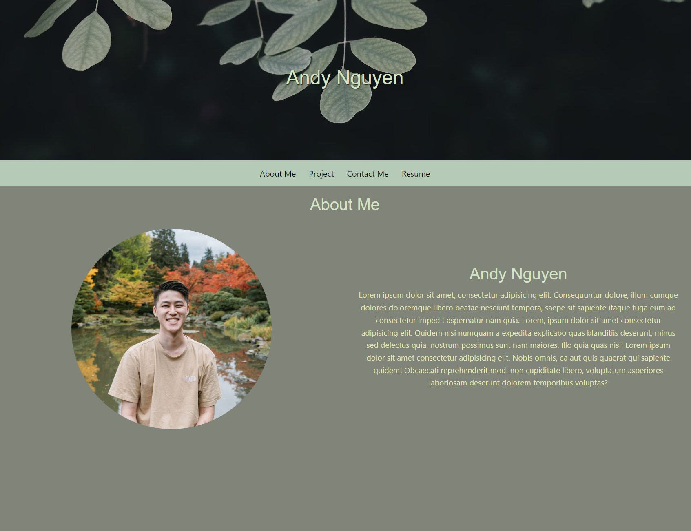
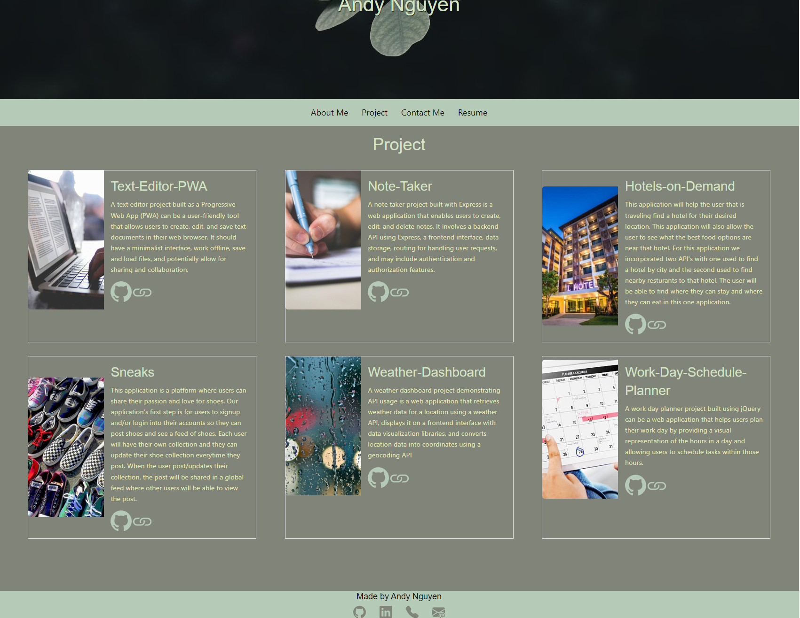
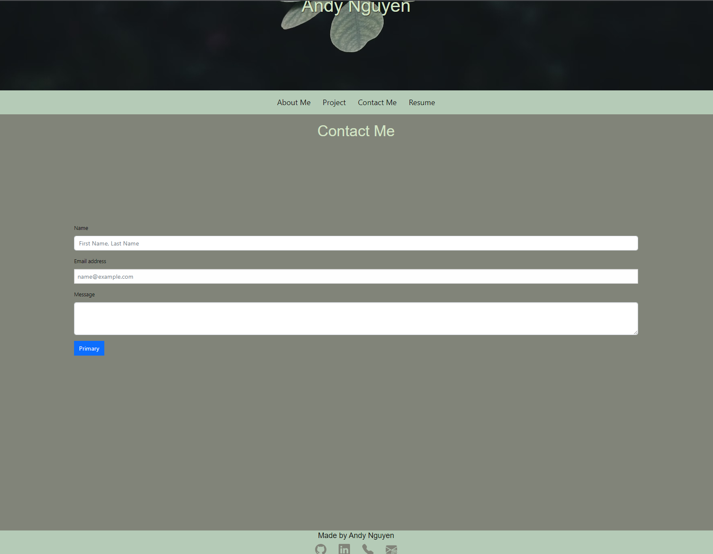
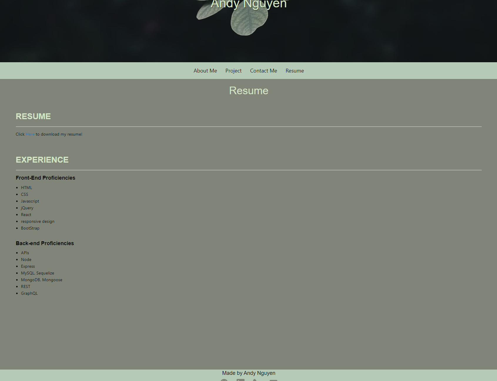

# React-Portfolio
By: thandyn

Email: nguyenphuthan@gmail.com
## Links: https://thandyn.github.io/React-Portfolio/

Github repo: https://github.com/thandyn/React-Portfolio

Deployed website: 

## Description
This project demonstrate building a portfolio using React. 

## Table of Content 
  - [Links](#links)
  - [Usage](#usage)
  - [Questions](#questions)
  - [License](#license)
  - [Contribute](#contribute)

## Usage

This is the home page. By default, it will always be the "about me". All page will display a header, navbar, and footer. 

This is all the project I've worked on with the title, description, and two icon that acts as a link. The icon links are working and will take users to the github repo and deployed site. 

This is the contact page. Users may leave messages. 

The final page is the resume with all my listed skills. A link to download the resume is also there. 

## License
MIT

## Contribute
If you wish to contribute to this project, please email me.

## Questions
If you have any questions, please email me at: nguyenphuthan@gmail.com. 
For more information, please visit my Github link: https://github.com/thandyn/.
